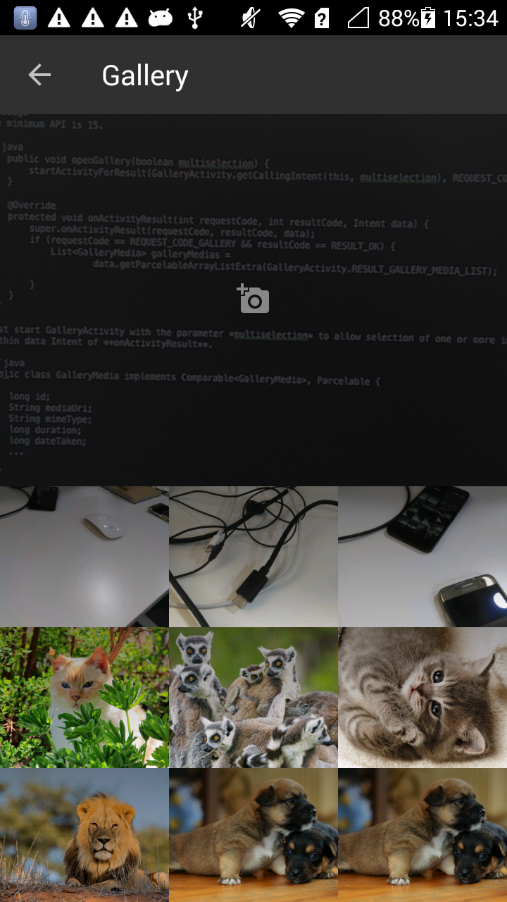
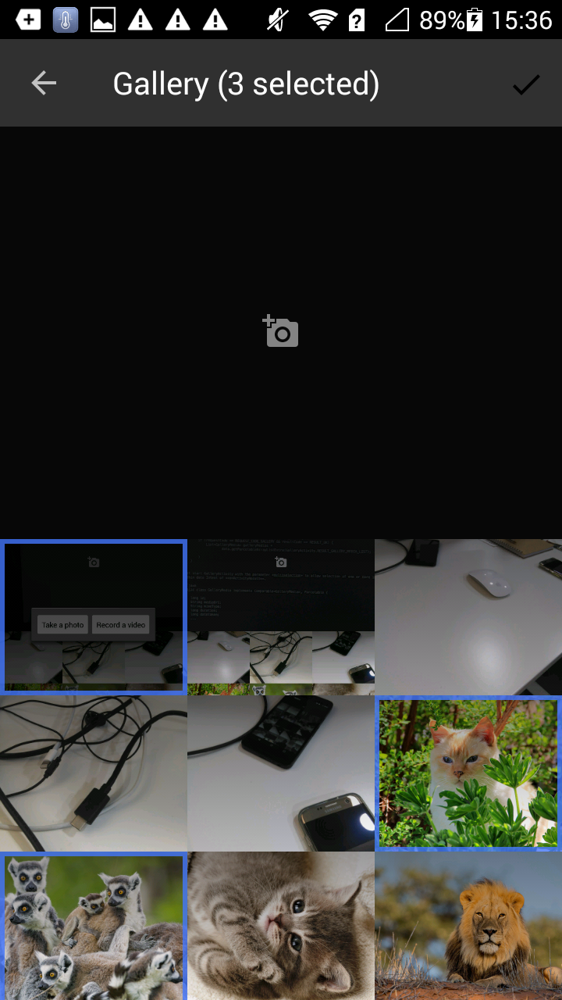
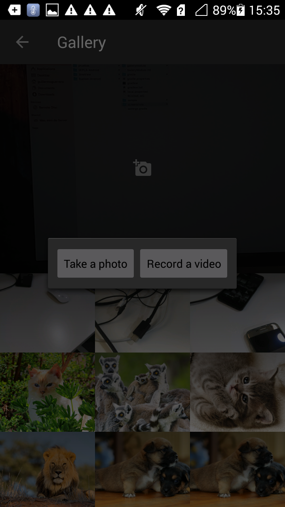

[](https://travis-ci.org/guiguegon/GalleryModule)
[](https://jitpack.io/#guiguegon/GalleryModule)
[](https://android-arsenal.com/details/1/4382)

# GalleryModule
Have you ever faced the need of build a gallery for your users to pick a image? or to take a new photo to use it as avatar? GalleryModule
is just that in one library. The user will be prompted to pick one or multiple images from the device and also take new photos or videos

## Web
See GalleryModule post series in my [blog](http://guiguegon.es/blog/)

## Download
Add the following dependency to your gradle file
```java
compile 'es.guiguegon:gallerymodule:1.3.0'
```

or use JitPack [](https://jitpack.io/#guiguegon/GalleryModule)

## Usage
The minimum API is 15. Working with API 24

```java
public void openGallery() {
      startActivityForResult(new GalleryHelper()
                    .setMultiselection(true)
                    .setMaxSelectedItems(maxSelectedItems)
                    .setShowVideos(showVideos))
                    .getCallingIntent(this), REQUEST_CODE_GALLERY);
}

@Override
protected void onActivityResult(int requestCode, int resultCode, Intent data) {
    super.onActivityResult(requestCode, resultCode, data);
    if (requestCode == REQUEST_CODE_GALLERY && resultCode == RESULT_OK) {
        List<GalleryMedia> galleryMedias =
                data.getParcelableArrayListExtra(GalleryActivity.RESULT_GALLERY_MEDIA_LIST);

    }
}
```

The results are returned within data Intent of **onActivityResult**. GalleryMedia is a simple model for returning the data.

```java
public class GalleryMedia implements Comparable<GalleryMedia>, Parcelable {

    long id;
    String mediaUri;
    String mimeType;
    long duration;
    long dateTaken;
    ...
}
```

## Parameters

+ **multiselection** allows to pick more than one picture/video
+ **maxSelectedItems** limit the number of items that can be selected
+ **showVideos** show gallery videos or not

## Screenshots





License
=======

    Copyright 2016 Guillermo Guerrero González

    Licensed under the Apache License, Version 2.0 (the "License");
    you may not use this file except in compliance with the License.
    You may obtain a copy of the License at

       http://www.apache.org/licenses/LICENSE-2.0

    Unless required by applicable law or agreed to in writing, software
    distributed under the License is distributed on an "AS IS" BASIS,
    WITHOUT WARRANTIES OR CONDITIONS OF ANY KIND, either express or implied.
    See the License for the specific language governing permissions and
    limitations under the License.

